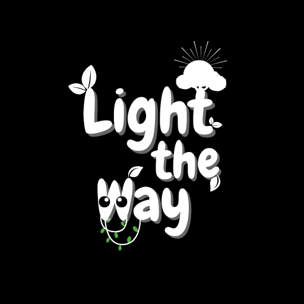

# Light the Way



**Light the Way** เป็นเกม 3D แนวผจญภัยที่พัฒนาด้วย Unity ในรูปแบบโปรเจกต์กลุ่ม  
ผู้เล่นจะได้สำรวจพื้นที่ ดำเนินเนื้อเรื่อง พูดคุยกับตัวละคร และต่อสู้กับศัตรูเพื่อดำเนินเกมไปจนถึงบทสรุป

Repository นี้รวบรวมเฉพาะ **Source Code ในส่วนที่ผมพัฒนา** ในตำแหน่ง Unity Game Developer

> **หมายเหตุเกี่ยวกับโปรเจกต์**  
> Light the Way เป็นหนึ่งในโปรเจกต์ Unity ช่วงแรก ๆ ของผม ในขณะนั้นยังอยู่ในช่วงเรียนรู้เกี่ยวกับการออกแบบโครงสร้างโค้ดและระบบภายในเกม ทำให้บางระบบถูกแยกออกเป็น Script หลายไฟล์และใช้วิธีการเขียนที่ค่อนข้างตรงไปตรงมา  
>
> ผมเก็บ Source Code ไว้ในรูปแบบเดิม เพื่อแสดงให้เห็นถึงประสบการณ์และพัฒนาการในการพัฒนาเกมของผม

---

## 🎮 Gameplay

ผู้เล่นเริ่มต้นเกมด้วยเนื้อเรื่องแนะนำตัวละครและเมือง ก่อนที่จะสามารถเดินสำรวจพื้นที่ภายในเกมได้

ระหว่างทางผู้เล่นสามารถเลือกเข้าไปยังพื้นที่อาหารเพื่อทำกิจกรรมได้ หรือสามารถเดินทางกลับบ้านเพื่อไปพบกับป้าและดำเนินเนื้อเรื่องต่อได้ทันที

หลังจากพูดคุยกับป้า เนื้อเรื่องจะดำเนินเข้าสู่วันถัดไป และผู้เล่นจะพบว่าป้าถูกลักพาตัวไป

ผู้เล่นจึงต้องออกเดินทาง ต่อสู้กับมอนสเตอร์ และเผชิญหน้ากับบอส ก่อนที่จะสามารถช่วยป้าและจบเกมได้

---

## 🔄 Game Loop

```text
เริ่มเกม
   ↓
เนื้อเรื่องแนะนำตัวละครและเมือง
   ↓
สำรวจพื้นที่
   ↓
กิจกรรมอาหาร (ไม่บังคับ)
   ↓
กลับบ้านและพูดคุยกับป้า
   ↓
เข้าสู่วันถัดไป
   ↓
ป้าถูกลักพาตัว
   ↓
เดินทางและต่อสู้กับมอนสเตอร์
   ↓
ต่อสู้กับบอส
   ↓
ช่วยเหลือป้า
   ↓
จบเกม
```

> ในเวอร์ชันที่ส่งงาน ผู้เล่นสามารถเดินข้ามมอนสเตอร์ทั่วไปและไปต่อสู้กับบอสได้ทันที เนื่องจากในขณะนั้นยังไม่มีระบบตรวจสอบเงื่อนไขว่าผู้เล่นกำจัดมอนสเตอร์ครบแล้วหรือไม่ ซึ่งเป็นหนึ่งในจุดที่ผมมองเห็นว่าสามารถนำไปปรับปรุงในการพัฒนาเกมครั้งต่อไปได้

---

## ✨ ระบบภายในเกม

- ระบบควบคุมตัวละครแบบ Third-Person
- ระบบควบคุมกล้อง
- Animation การเดินและวิ่ง
- ระบบต่อสู้ด้วยดาบ
- ระบบธนูและลูกธนู
- ระบบสลับอาวุธ
- ระบบตรวจจับและเคลื่อนที่ของศัตรู
- ระบบ HP และ Damage ของศัตรู
- Boss Battle
- ระบบ HP และ Stats ของผู้เล่น
- ระบบ XP และอัปเกรด Stats
- ระบบเนื้อเรื่องและบทสนทนา
- ระบบกิจกรรมอาหาร
- ระบบเปลี่ยน Scene
- ระบบบันทึกข้อมูลพื้นฐานด้วย PlayerPrefs
- ระบบ Game Over และ Win

---

## 👨‍💻 หน้าที่ที่รับผิดชอบ

**Role: Game Developer**

หน้าที่หลักที่ผมรับผิดชอบภายในโปรเจกต์ ได้แก่

- พัฒนาระบบควบคุมตัวละครและกล้อง
- พัฒนาระบบต่อสู้ด้วยดาบและธนู
- พัฒนาระบบสลับอาวุธ
- พัฒนาระบบตรวจจับผู้เล่นและการเคลื่อนที่ของศัตรู
- พัฒนาระบบ HP, Attack และ XP
- พัฒนาระบบเนื้อเรื่องและลำดับเหตุการณ์
- พัฒนาระบบกิจกรรมอาหาร
- พัฒนาระบบเปลี่ยน Scene และลำดับการดำเนินเกม
- พัฒนาระบบบันทึกข้อมูลพื้นฐานด้วย PlayerPrefs
- เชื่อมต่อระบบ Gameplay เข้ากับ Animation และ UI
- มีส่วนร่วมในการออกแบบฉากและ Gameplay

---

## 📁 Source Code

Source Code ภายใน Repository ถูกแบ่งตามระบบเพื่อให้ง่ายต่อการดูและศึกษา

```text
SourceCode/
│
├── Combat/
│   ├── Arrow.cs
│   └── HitboxScript.cs
│
├── Enemy/
│   ├── Enemy.cs
│   └── Enemy1.cs
│
├── Food/
│   ├── CupEat.cs
│   ├── Food.cs
│   └── GoBackFormFood.cs
│
├── Menu/
│   ├── Loss.cs
│   ├── LossMenu.cs
│   └── MainMenu.cs
│
├── Player/
│   ├── Camera.cs
│   ├── Player.cs
│   └── Stats.cs
│
├── Scene/
│   └── day2gotoScenen2.cs
│
└── Story/
    ├── Story.cs
    ├── Story2.cs
    ├── Story3.cs
    └── Story4.cs
```

---

## 🛠️ เครื่องมือที่ใช้

- Unity 3D
- C#
- Unity Animator
- Unity Physics
- PlayerPrefs

---

## ⚠️ Known Issues

เนื่องจาก Light the Way เป็นหนึ่งในโปรเจกต์ Unity ช่วงแรก ๆ ของผม ตัวเกมเวอร์ชันสุดท้ายจึงยังมีข้อจำกัดบางส่วน ได้แก่

- ผู้เล่นสามารถเดินข้ามมอนสเตอร์ทั่วไปและไปต่อสู้กับบอสได้ทันที
- ระบบ Save HP มีปัญหาเมื่อผู้เล่นเสียชีวิตใน Scene 2 เนื่องจากค่า HP ที่ถูกบันทึกไว้อาจเป็น `0` ทำให้เมื่อเริ่มเล่นใหม่ ตัวละครยังคงมี HP เป็น `0` และเข้าสู่สถานะแพ้อีกครั้ง
- ระบบบางส่วนถูกแบ่งออกเป็น Script หลายไฟล์ และยังไม่ได้ออกแบบโครงสร้างให้รองรับการขยายระบบในอนาคต

ข้อจำกัดเหล่านี้ทำให้ผมได้เรียนรู้ถึงความสำคัญของการออกแบบ Game Flow, การจัดการ Game State, ระบบ Save/Load และการวางโครงสร้าง Code ก่อนเริ่มพัฒนาระบบที่มีขนาดใหญ่ขึ้น

---

## 📈 สิ่งที่ได้เรียนรู้จากโปรเจกต์

Light the Way ทำให้ผมได้เรียนรู้กระบวนการสร้างเกมด้วย Unity ตั้งแต่ต้นจนสามารถพัฒนาเป็นเกมที่เล่นจนจบได้

ผมได้ฝึกพัฒนาระบบหลายส่วน เช่น Player Movement, Combat, Enemy, UI, Story, Scene Management และการบันทึกข้อมูล

เมื่อย้อนกลับมาดูโปรเจกต์นี้อีกครั้ง ผมสามารถมองเห็นข้อจำกัดของวิธีการเขียน Code ในช่วงนั้นได้ชัดเจนมากขึ้น ทั้งการแบ่งหน้าที่ของ Script, การจัดการ State, การออกแบบ Game Flow และระบบ Save/Load

ประสบการณ์จากโปรเจกต์นี้จึงเป็นพื้นฐานสำคัญที่ผมนำไปปรับใช้กับโปรเจกต์ Unity ในภายหลัง

---

## 📸 Screenshots

### การสำรวจพื้นที่


### ระบบต่อสู้


### Boss Fight


---

## 📺 Gameplay Video

[▶ รับชม Gameplay บน YouTube](https://www.youtube.com/watch?v=Z0_kZA-K1BA)

---

## 📌 เกี่ยวกับ Repository นี้

Repository นี้เผยแพร่เฉพาะ **Source Code ที่เกี่ยวข้องกับงานพัฒนาเกมของผม**

ไฟล์ 3D Model, Texture, Audio และ Asset อื่น ๆ ภายในตัวเกมไม่ได้ถูกนำมาเผยแพร่ใน Repository นี้ เนื่องจากบางส่วนเป็นผลงานของสมาชิกในทีมและบางส่วนมาจาก External Assets

Repository นี้จัดทำขึ้นเพื่อแสดงผลงานด้าน Programming และประสบการณ์ในการพัฒนาเกมด้วย Unity ในตำแหน่ง **Unity Game Developer**
